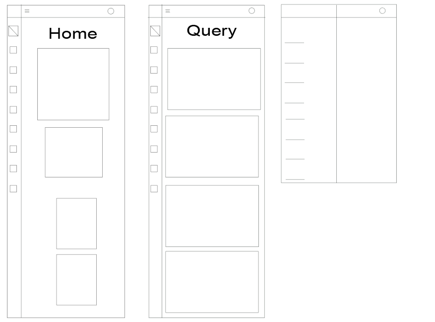

# Fenix Garden - Spring Boot

-   [Introduction](#introduction)
-   [Tecnologies](#technologies)
-   [Usage](#usage)
-   [Database](#database)
    -   [Model](#model)
    -   [Queries](#queries)
-   [Backend](#backend)
    -   [Class Diagram](#class-diagram)
    -   [Models](#models)
        -   [DTOs](#dtos)
    -   [Repositories](#repositories)
    -   [Services](#services)
    -   [Controllers](#controllers)
    -   [Exceptions](#exceptions)
    -   [Security](#security)
    -   [CORS](#cors)
-   [Frontend](#frontend)
    -   [Designs](#designs)
    -   [UI Design](#ui-design)
    -   [Result](#result)
    -   [Functionalities](#functionalities)

# Introduction

This project aims to develop software that enables the support of operations for a gardening sector company. Its structure encompasses various areas, from office and employee details to the management of clients, orders, products, and payments. Java programming language, Spring Boot framework, and either MySQL or PostgreSQL database will be used for development. The scope of this development is limited to creating a web application with both backend and frontend components following good development practices.

# Technologies

-   JWT
-   Java
-   MySQL
-   [UI Verse](https://uiverse.io/elements?t=css)
-   Hibernate
-   JavaScript
-   HTML/CSS
-   Spring Web
-   Spring Boot
-   Spring Security
-   Spring Data JPA
-   Adobe Illustrator
-   Swagger (OpenApi)

# Usage

> [!NOTE]
> To use and run the project in a better way we really recommend you have installed an IDE as IntelliJ.

-   First, clone the repository on your local machine.

    ```bash
    git clone https://github.com/jstorra/fenix-garden-springboot.git
    ```

-   Open the project in your IDE.

> [!IMPORTANT]
> Before running the project you must have created the database, run the following code [fenixgardenDB](./fenixgarden/src/main/resources/DB.sql) in your MySQL DBMS.

-   Change the [application.properties](./fenixgarden/src/main/resources/application.properties) in case you have modified your MySQL properties like host, port, username or even the password.

-   Now run the project, if everything is alright you won't see any error in output console.

> [!TIP]
> Enjoy our software.

# Database

For this project, there is a database named "fenixgarden," designed to support the operations and management of a company dedicated to gardening. Its structure includes various tables covering key aspects of business operations, from internal office organization and employee management to detailed tracking of products, orders, and financial transactions with customers.

The "oficina" table stores information about the company's different locations, including details such as city, country, and postal code. On the other hand, the "empleado" table encompasses data related to personnel, such as names, positions, and hierarchical relationships. Product management is carried out through the "producto" table, which includes details such as name, range, and quantity in stock.

Customer interaction is recorded in the "cliente" table, where contact information, credit limits, and sales representatives are stored. Orders placed by customers are detailed in the "pedido" table, while the "detalle_pedido" table provides specific information about the products included in each order, such as quantity and price.

Furthermore, the database addresses financial aspects through the "pago" table, which records transactions made by customers, detailing the payment method, date, and total amount. Product range management is defined in the "gama_producto" table, which contains descriptions and links to images for each category of offered products.

Overall, this database (based on MySQL) provides an organized structure to support the comprehensive operation of a gardening company, covering internal management, customer interactions, and associated financial transactions.

# Model


## Queries

<details>
  <summary><code>Customer</code></summary>

-   Return a list with the names of all Spanish clients.
-   Return a list with the client code of those clients who made some payment in 2008. Keep in mind that you should remove any repeated client codes.
-   Return a list with all clients who are from the city of Madrid and whose sales representative has the employee code 11 or 30.
-   Obtain a list with the name of each client and the name and surname of their sales representative.
-   Show the name of clients who have made payments along with the name of their sales representatives.
-   Show the name of clients who have not made payments along with the name of their sales representatives.
-   Return the name of clients who have made payments and the name of their representatives along with the city of the office to which the representative belongs.
-   Return the name of clients who have not made payments and the name of their representatives along with the city of the office to which the representative belongs.
-   Return a list showing only the clients who have not made any payments.
-   Return a list showing only the clients who have not placed any orders.
-   Return a list showing the clients who have not made any payments and those who have not placed any orders.
-   Return the name of clients who have not been delivered an order on time.
-   Return a list of clients who have placed orders but have not made any payments.
-   How many clients does each country have?
-   Calculate the number of clients the company has.
-   How many clients are located in the city of Madrid?
-   Calculate how many clients each of the cities starting with 'M' has.
-   Calculate the number of clients who do not have an assigned sales representative.
-   Return the name of sales representatives and the number of clients each one serves.
-   Calculate the date of the first and last payment made by each client. The list should display the name and surnames of each client.

</details>

<details>
  <summary><code>Office</code></summary>

-   Return a list with the office code and the city where there are offices.
-   Return a list with the city and phone number of the offices in Spain.
-   List the address of offices that have clients in Fuenlabrada.
-   Return the offices where none of the employees who have been sales representatives for a client who has purchased a product from the Fruits range work.

</details>

<details>
  <summary><code>Employee</code></summary>

-   Return a list with the name, surname, and email of employees whose boss has a boss code equal to 7.
-   Return the position name, name, surname, and email of the company's boss.
-   Return a list with the name, surname, and position of those employees who are not sales representatives.
-   Return a list with the name of the employees along with the name of their bosses.
-   Return a list showing the name of each employee, the name of their boss, and the name of their boss's boss.
-   Return a list showing only the employees who do not have an associated office.
-   Return a list showing only the employees who do not have an associated client.
-   Return a list showing only the employees who do not have an associated client along with the data of the office where they work.
-   Return a list showing the employees who do not have an associated office and those who do not have an associated client.
-   Return a list with the data of employees who do not have associated clients and the name of their associated boss.
-   How many employees are there in the company?

</details>

<details>
  <summary><code>Payment</code></summary>

-   Return a list with all payments made in the year 2008 through Paypal. Sort the result from highest to lowest.
-   Return a list with all payment methods that appear in the payment table. Keep in mind that payment methods should not appear repeated.
-   What was the average payment in 2009?
-   Show the total sum of all payments made for each of the years appearing in the payments table.

</details>

<details>
  <summary><code>Order</code></summary>

-   Return a list with the different statuses an order can go through.
-   Return a list with the order code, client code, expected date, and delivery date of orders that have not been delivered on time.
-   Return a list with the order code, client code, expected date, and delivery date of orders whose delivery date has been at least two days before the expected date.
-   Return a list of all orders that were rejected in 2009.
-   Return a list of all orders that have been delivered in the month of January of any year.
-   Return the name of the clients to whom an order has not been delivered on time.
-   How many orders are there in each state? Sort the result in descending order by the number of orders.

</details>

<details>
  <summary><code>Product</code></summary>

-   Return a list with all products belonging to the Ornamental range and having more than 100 units in stock. The list should be ordered by their selling price, showing the highest-priced products first.
-   Return a list of products that have never appeared in an order.
-   Return a list of products that have never appeared in an order. The result should display the name, description, and image of the product.
-   Calculate the selling price of the most expensive and cheapest product in a single query.
-   Return a list of the top 20 best-selling products and the total number of units sold for each one. The list should be ordered by the total number of units sold.

</details>

<details>
  <summary><code>OrderDetail</code></summary>

-   The total revenue the company has had in its entire history, indicating the taxable base, the VAT, and the total invoiced. The taxable base is calculated by adding the product cost multiplied by the number of units sold from the order detail table. The VAT is 21% of the taxable base, and the total is the sum of the previous two fields.
-   The same information as in the previous question, but grouped by product code.
-   The same information as in the previous question, but grouped by product code filtered by codes starting with 'OR'.
-   List the total sales of products that have invoiced more than 3000 euros. It will show the name, units sold, total invoiced, and total invoiced with taxes (21% VAT).
-   Calculate the number of different products in each of the orders.
-   Calculate the sum of the total quantity of all products appearing in each of the orders.

</details>

<details>
  <summary><code>GamaProduct</code></summary>

-   Return a list of the different product gamas that each client has purchased.

</details>

# Backend

The backend of this project developed in Spring Boot acts as the central engine that handles business logic and data management. Responsible for processing client requests, it interacts with the database to store, retrieve, and manipulate necessary information. Additionally, it provides RESTful services for the frontend to consume and present data efficiently. In summary, the backend serves as the functional core of the system, ensuring a secure and effective flow of data between the client and the database. **Here is the implementation:**

## Class Diagram

> [!NOTE]
> To download or open the class diagram you must have [StarUML](https://staruml.io/) or another UML in order to open it, if you already have one just open the file ubicated in backend resources [here](./fenixgarden/src/main/resources/fenixgarden.mdj).


## Models

<details>
  <summary><code>Customer</code></summary>

Represents a customer in a management system, such as a company's database. Here's a general description of each attribute and its purpose:

-   `customerCode`: It's the unique code identifying each customer in the database.
-   `customerName`: It's the name of the customer.
-   `contactName`: It's the name of the customer's main contact.
-   `contactLastName`: It's the last name of the customer's main contact.
-   `phone`: It's the phone number of the customer.
-   `fax`: It's the fax number of the customer.
-   `addressLine1`: It's the first line of the customer's address.
-   `addressLine2`: It's the second line of the customer's address (optional).
-   `city`: It's the city where the customer is located.
-   `region`: It's the region or state where the customer is located (optional).
-   `country`: It's the country where the customer is located.
-   `zipCode`: It's the zip code of the customer.
-   `creditLimit`: It's the credit limit assigned to the customer.
-   `repSales`: It's the sales representative assigned to the customer, which is an object of the `Employee` class.
-   `payments`: It's a list of payments made by the customer, which are objects of the `Payment` class.
-   `orders`: It's a list of orders placed by the customer, which are objects of the `Order` class.

In addition to the attributes, the class also has methods to convert a `Customer` object to a `CustomerDTO` (Data Transfer Object) for facilitating data transfer between application layers.

The `toString()` method provides a string representation of a `Customer` object, useful for debugging and logging.

</details>

<details>
  <summary><code>Office</code></summary>

Represents an office location in a management system, typically used in the context of a company or organization. Here's a general description of each attribute and its purpose:

-   `officeCode`: It's a unique code identifying each office.
-   `city`: It's the city where the office is located.
-   `country`: It's the country where the office is located.
-   `region`: It's the region or state where the office is located (optional).
-   `zipCode`: It's the zip code or postal code of the office.
-   `phone`: It's the phone number of the office.
-   `addressLine1`: It's the first line of the office's address.
-   `addressLine2`: It's the second line of the office's address (optional).
-   `employees`: It's a list of employees associated with this office.

Additionally, the class has methods to convert an `Office` object to an `OfficeDTO` (Data Transfer Object) for transferring data between application layers.

The `toString()` method provides a string representation of an `Office` object, useful for debugging and logging purposes.

</details>

<details>
  <summary><code>Employee</code></summary>

Represents an employee within an organization. Here's a general description of each attribute and its purpose:

-   `employeeCode`: It's a unique code identifying each employee.
-   `name`: It's the first name of the employee.
-   `lastName1`: It's the first part of the last name of the employee.
-   `lastName2`: It's the second part of the last name of the employee (optional).
-   `extension`: It's the extension number of the employee's phone.
-   `email`: It's the email address of the employee.
-   `role`: It's the job role or position of the employee.
-   `office`: It's the office where the employee works, which is an object of the `Office` class.
-   `boss`: It's the supervisor or manager of the employee, which is also an object of the `Employee` class.
-   `customers`: It's a list of customers associated with this employee, typically representing the clients the employee manages.

Additionally, the class has methods to convert an `Employee` object to an `EmployeeDTO` (Data Transfer Object) for transferring data between application layers.

The `toString()` method provides a string representation of an `Employee` object, useful for debugging and logging purposes.

</details>

<details>
  <summary><code>Payment</code></summary>

Represents a payment transaction within a system. Here's a general description of each attribute and its purpose:

-   `transactionId`: It's a unique identifier for each payment transaction.
-   `wayToPay`: It indicates the method used for the payment (e.g., credit card, cash, etc.).
-   `paymentDate`: It's the date when the payment was made.
-   `total`: It's the total amount of the payment.
-   `customer`: It's the customer associated with this payment transaction, represented by an object of the `Customer` class.

Additionally, the class has a method to convert a `Payment` object to a `PaymentDTO` (Data Transfer Object) for transferring data between application layers.

The `toString()` method provides a string representation of a `Payment` object, useful for debugging and logging purposes.

</details>

<details>
  <summary><code>Order</code></summary>

Represents an order placed within a system. Here's a general description of each attribute and its purpose:

-   `orderCode`: It's a unique identifier for each order.
-   `orderDate`: It's the date when the order was placed.
-   `expectedDate`: It's the expected delivery date for the order.
-   `deliverDate`: It's the actual delivery date of the order (nullable).
-   `status`: It indicates the status of the order (e.g., pending, delivered, etc.).
-   `comments`: It allows for additional comments or notes regarding the order (nullable).
-   `customer`: It's the customer associated with this order, represented by an object of the `Customer` class.

Additionally, the class has a method to convert an `Order` object to an `OrderDTO` (Data Transfer Object) for transferring data between application layers.

The `toString()` method provides a string representation of an `Order` object, useful for debugging and logging purposes.

</details>

<details>
  <summary><code>Product</code></summary>

Represents a product within a system. Here's a general description of each attribute and its purpose:

-   `productCode`: It's a unique identifier for each product.
-   `name`: It's the name of the product.
-   `gamaProduct`: It represents the product category or range, associated with an object of the `GamaProduct` class.
-   `dimensions`: It provides the dimensions or size of the product.
-   `supplier`: It indicates the supplier of the product.
-   `description`: It describes the product.
-   `amountInStock`: It's the quantity of the product available in stock.
-   `salePrice`: It's the selling price of the product.
-   `supplierPrice`: It's the price at which the product is purchased from the supplier.

Additionally, the class has a method to convert a `Product` object to a `ProductDTO` (Data Transfer Object) for transferring data between application layers.

The `toString()` method provides a string representation of a `Product` object, useful for debugging and logging purposes.

</details>

<details>
  <summary><code>OrderDetail</code></summary>

Represents the details of an order, including information about the products included in the order. Below is an overview of each attribute and its purpose:

-   `id`: It's an embedded composite primary key consisting of the order code and the product code.
-   `order`: It represents the order associated with this order detail.
-   `product`: It represents the product included in this order detail.
-   `amount`: It indicates the quantity of the product included in the order detail.
-   `unitPrice`: It's the price per unit of the product.
-   `numberLine`: It's a number assigned to each line in the order detail.

Additionally, the class has a method to convert an `OrderDetail` object to an `OrderDetailDTO` (Data Transfer Object) for transferring data between application layers.

The `toString()` method provides a string representation of an `OrderDetail` object, useful for debugging and logging purposes.

</details>

<details>
  <summary><code>GamaProduct</code></summary>

Represents a product category or product range. Here's a breakdown of its attributes:

-   `gama`: This attribute represents the identifier or code for the product range. It's the primary key of the entity.
-   `textDescription`: It holds the textual description of the product range.
-   `htmlDescription`: It stores the HTML-formatted description of the product range.
-   `image`: This attribute contains the path or URL to an image representing the product range.
-   `products`: It's a list of products that belong to this product range.

The `GamaProduct` class also includes methods to convert a `GamaProduct` object to a `GamaProductDTO` (Data Transfer Object) for transferring data between application layers. This DTO includes information like the product range identifier, textual description, HTML description, and image.

The `toString()` method provides a string representation of a `GamaProduct` object, which can be useful for debugging and logging purposes.

</details>

<details>
  <summary><code>User</code></summary>

Represents a user in the system. Here's a breakdown of its attributes:

-   `id`: This attribute serves as the primary key of the `User` entity. It's auto-generated and is used for uniquely identifying users.
-   `username`: It stores the username of the user. It must be unique and cannot be null.
-   `encryptedPass`: This attribute holds the encrypted password of the user. It cannot be null.
-   `token`: It's a transient attribute, meaning it's not persisted in the database. It holds a token associated with the user, typically used for authentication or session management.

The `User` class includes constructors to instantiate `User` objects with different sets of parameters. It also includes getter and setter methods for accessing and modifying the attributes.

The `@Entity` annotation marks the class as an entity, indicating that it will be persisted to the database. The `@Table` annotation specifies the name of the table in the database where the entity will be stored.

The `@JsonIgnore` annotation is used to ignore certain attributes during serialization and deserialization processes, typically used with JSON serialization libraries like Jackson. In this case, the `id`, `username`, and `encryptedPass` attributes are ignored during JSON serialization and deserialization, meaning they won't be included in JSON representations of `User` objects.

</details>

## DTOs

> [!NOTE]
> DTOs are used to transfer data between different parts of an application, such as the user interface and the database. They help separate concerns, reduce coupling, optimize network traffic, control security, and facilitate adaptation to different data exchange formats. In summary, they make communication between different parts of the application more efficient and secure.

-   [CustomerDTO](./fenixgarden/src/main/java/com/campus/fenixgarden/models/dtos/CustomerDTO.java)
-   [OfficeDTO](./fenixgarden/src/main/java/com/campus/fenixgarden/models/dtos/OfficeDTO.java)
-   [EmployeeDTO](./fenixgarden/src/main/java/com/campus/fenixgarden/models/dtos/EmployeeDTO.java)
-   [PaymentDTO](./fenixgarden/src/main/java/com/campus/fenixgarden/models/dtos/PaymentDTO.java)
-   [OrderDTO](./fenixgarden/src/main/java/com/campus/fenixgarden/models/dtos/OrderDTO.java)
-   [ProductDTO](./fenixgarden/src/main/java/com/campus/fenixgarden/models/dtos/ProductDTO.java)
-   [OrderDetailDTO](./fenixgarden/src/main/java/com/campus/fenixgarden/models/dtos/OrderDetailDTO.java)
-   [GamaProductDTO](./fenixgarden/src/main/java/com/campus/fenixgarden/models/dtos/GamaProductDTO.java)

<details>
  <summary><code>TransformResultList</code></summary>

Class that provides a static method to transform a list of object arrays into a list of maps. This transformation is done by taking the values from the object arrays and assigning them to the field names provided as arguments. The main purpose of this class is to provide a convenient way to structure and manipulate query or data processing results in the form of a list of maps. The class is designed to be used as a Spring component, which means it can be injected and used in other parts of a Spring application.

</details>

## Repositories

<details>
  <summary><code>CustomerRepository</code></summary>

Interface used to interact with the database in a Spring Boot application related to customer entities (`Customer`). It extends the `JpaRepository` interface and provides predefined methods for basic CRUD operations on the `Customer` entity.

In addition to standard CRUD methods, this repository interface also includes custom methods that use JPQL queries to perform more specific operations in the database:

1. **findByCountryLikeIgnoreCase**: Finds customers by country, ignoring case.
2. **clientsWithPaymentsYear**: Retrieves a list of customer codes that made payments in a specific year.
3. **clientsInMadridWithSpecificRepresentatives**: Retrieves a list of customers in Madrid with specific sales representatives.
4. **clientsSalesRepresentatives**: Retrieves a list of customer codes, customer names, and full names of associated sales representatives.
5. **clientsWithPaymentsAndRepresentatives**: Retrieves a list of customers with made payments and associated sales representatives.
6. **clientsWithoutPaymentsAndRepresentatives**: Retrieves a list of customers without payments or associated sales representatives.
7. **clientsWithPaymentsAndRepresentativesWithOfficeCity**: Retrieves a list of customers with made payments, sales representatives, and associated office city.
8. **clientsWithoutPaymentsAndRepresentativesWithOfficeCity**: Retrieves a list of customers without payments or sales representatives, with associated office city.
9. **clientsWithoutPayments**: Retrieves a list of customers without payments.
10. **clientsWithoutOrders**: Retrieves a list of customers without orders.
11. **clientsWithoutPaymentsAndOrders**: Retrieves a list of customers without payments or orders.
12. **clientsWithLateDeliveries**: Retrieves a list of customer names that experienced late deliveries.
13. **clientsWithOrdersButNoPayments**: Retrieves a list of customers with orders but no associated payments.
14. **clientsCountByCountry**: Retrieves a count of customers by country.
15. **totalClients**: Retrieves the total number of customers.
16. **clientsCountInCity**: Retrieves the number of customers in a specific city.
17. **clientsCountInCitiesStartingWithM**: Retrieves a count of customers in cities starting with a specific letter.
18. **clientsWithoutSalesRepresentative**: Retrieves the number of customers without a sales representative.
19. **salesRepresentativesAndClientCount**: Retrieves a list of sales representative codes, full names, and associated client counts.
20. **firstLastPaymentDateByClient**: Retrieves the first and last payment dates by client.

</details>

<details>
  <summary><code>OfficeRepository</code></summary>

Serves as an interface for interacting with the database in a Spring Boot application related to office entities. Similar to the `CustomerRepository`, it extends the `JpaRepository` interface and provides predefined methods for basic CRUD operations on the `Office` entity.

In addition to the standard CRUD methods, this repository interface also includes custom methods that use JPQL queries to perform more specific operations in the database:

1. **listOfficeCodeAndCity**: Retrieves a list of office codes and cities for all offices.
2. **listCityAndPhoneOfSpanishOffices**: Retrieves a list of office codes, cities, and phone numbers for Spanish offices.
3. **listOfficeAddressesWithClientsInFuenlabrada**: Retrieves a list of distinct office addresses where clients are located in Fuenlabrada.
4. **findOfficesWithoutFruitOrders**: Retrieves a list of offices that do not have orders for fruit products. This query involves multiple joins across the Employee, Customer, Payment, Order, OrderDetail, and Product entities to filter offices based on the product category.

</details>

<details>
  <summary><code>EmployeeRepository</code></summary>

Interface used to interact with the database in a Spring Boot application related to employee entities (`Employee`). It extends the `JpaRepository` interface and provides predefined methods for basic CRUD operations on the `Employee` entity.

In addition to standard CRUD methods, this repository interface also includes custom methods that use JPQL queries to perform more specific operations in the database:

1. **employeesUnderSupervisorCode**: Retrieves a list of employee codes that are under a specific supervisor.
2. **bossDetails**: Retrieves details of bosses (employees without a supervisor).
3. **nonSalesRepresentativesDetails**: Retrieves details of representatives who are not sales representatives (employees without assigned clients).
4. **employeesWithSupervisors**: Retrieves details of employees with their supervisors.
5. **employeesWithSupervisorsAndGrandSupervisors**: Retrieves details of employees with their supervisors and their grand supervisors.
6. **employeesWithoutOffice**: Retrieves a list of employees who do not have an assigned office.
7. **employeesWithoutClients**: Retrieves a list of employees who do not have assigned clients.
8. **employeesWithoutClientsAndOfficeDetails**: Retrieves details of employees who do not have assigned clients and office details.
9. **employeesWithoutOfficeAndClients**: Retrieves a list of employees who do not have an assigned office or assigned clients.
10. **employeesWithoutClientsAndSupervisor**: Retrieves details of employees who do not have assigned clients and a supervisor.
11. **totalEmployees**: Retrieves the total number of employees in the database.

</details>

<details>
  <summary><code>PaymentRepository</code></summary>

Interface is responsible for interacting with the database regarding payment entities (`Payment`). It extends the `JpaRepository` interface, providing methods for basic CRUD operations on the `Payment` entity.

In addition to the standard CRUD methods, this repository interface includes custom methods that use JPQL queries to perform specific operations in the database:

1. **findPaymentsIn2008ByPaypal**: Retrieves payments made via PayPal in the year 2008, ordered by total amount.
2. **findAllPaymentMethods**: Retrieves distinct payment methods used across all payments.
3. **findAveragePaymentFor2009**: Calculates the average payment amount for the year 2009.
4. **findTotalPaymentsByYear**: Retrieves the total payment amount for each year, grouped by year.

</details>

<details>
  <summary><code>OrderRepository</code></summary>

Interface manages interactions with the database related to orders (`Order` entities). It extends the `JpaRepository` interface, providing methods for basic CRUD operations on orders.

Here's an overview of the custom methods defined in this repository interface:

1. **findDistinctStatus**: Retrieves a list of distinct order statuses.
2. **findOrderDeliveredLate**: Retrieves orders where the delivery date is later than the expected date.
3. **findOrderDeliveredLateAtLeast**: Retrieves orders where the delivery date is at least two days later than the expected date.
4. **findRejectedOrdersInYear**: Retrieves orders that were rejected in a specific year.
5. **findAllOrdersDeliveredInJanuary**: Retrieves orders delivered in January.
6. **findClientsWithDelayedDeliveries**: Retrieves the names of clients who have experienced delayed deliveries.
7. **countOrdersByState**: Counts orders grouped by their status, ordered by the count in descending order.

</details>

<details>
  <summary><code>ProductRepository</code></summary>

Interface handles database operations related to products (`Product` entities). It extends the `JpaRepository` interface, which provides basic CRUD operations for managing products.

Below are the custom methods defined in this repository interface:

1. **findOrnamentalProductsInStockGreaterThan100**: Retrieves ornamental products with stock greater than 100 for a given product category (`gama`), ordered by sale price in descending order.
2. **findProductsNeverOrdered**: Retrieves products that have never been ordered.
3. **findProductsNeverOrderedWithName**: Retrieves details (name, description, image) of products that have never been ordered.
4. **findMaxAndMinProductPrices**: Retrieves the maximum and minimum sale prices of all products.
5. **findTop20BestSellingProducts**: Retrieves the top 20 best-selling products based on the total units sold in order details, grouped by product code and ordered by the total units sold in descending order.

</details>

<details>
  <summary><code>OrderDetailRepository</code></summary>

Interface manages database operations related to order details (`OrderDetail` entities). It extends the `JpaRepository` interface, which provides basic CRUD operations for managing entities.

Here are the custom methods defined in this repository interface:

1. **calculateTotalRevenue**: Calculates the total revenue, base imponible, and VAT for all order details.
2. **calculateRevenueByProduct**: Calculates the revenue, base imponible, and VAT for each product, grouped by product code.
3. **calculateRevenueByProductFilteredByOR**: Calculates the revenue, base imponible, and VAT for products whose product code starts with 'OR', grouped by product code.
4. **listTotalSalesOfProductsOver3000Euros**: Lists products with total sales revenue exceeding 3000 euros, along with the total units sold and the total revenue including VAT.
5. **calculateNumberOfProductsPerOrder**: Calculates the number of distinct products per order, grouped by order code.
6. **calculateTotalQuantityPerOrder**: Calculates the total quantity of products per order, grouped by order code.

</details>

<details>
  <summary><code>GamaProductRepository</code></summary>

Interface manages database operations related to product ranges (`GamaProduct` entities). It extends the `JpaRepository` interface, which provides basic CRUD operations for managing entities.

Here's the custom method defined in this repository interface:

1. **listProductRangesPurchasedByCustomer**: Retrieves a list of distinct customer names along with the product ranges they have purchased. It joins the `OrderDetail`, `Order`, `Customer`, `Product`, and `GamaProduct` entities and groups the results by customer name and product range.

</details>

<details>
  <summary><code>UserRepository</code></summary>

This repository acts as an interface for managing user entities in a Spring Boot application. Similar to other repositories, it extends the `JpaRepository` interface, which provides built-in methods for basic CRUD operations on the `User` entity.

In particular, this repository includes a custom method:

1. **findByUsername**: Retrieves a user by their username. This method allows searching for a user based on their unique username attribute.

</details>

## Services

<details>
  <summary><code>CustomerService</code></summary>

Provides methods for interacting with customer-related data in the application. It is annotated with `@Service` to indicate that it serves the role of a service component in a Spring application.

Here's a general overview of the service and its methods:

1. **getAllCustomers**: Retrieves a list of all customers and maps them to DTOs (Data Transfer Objects).
2. **findByCountryLikeIgnoreCase**: Finds customers by country while ignoring case, and maps them to DTOs. It also validates the country parameter to ensure it doesn't contain numbers.
3. **clientsWithPaymentsYear**: Retrieves a list of client IDs with payments made in a specific year. It converts the year parameter to an integer and handles exceptions for invalid number formats.
4. **clientsInMadridWithSpecificRepresentatives**: Retrieves customers located in Madrid with specific sales representatives.
5. **clientsSalesRepresentatives**: Retrieves a list of clients and their sales representatives.
6. **clientsWithPaymentsAndRepresentatives**: Retrieves clients with payments and their sales representatives.
7. **clientsWithoutPaymentsAndRepresentatives**: Retrieves clients without payments and their sales representatives.
8. **clientsWithPaymentsAndRepresentativesWithOfficeCity**: Retrieves clients with payments, their sales representatives, and the city of their offices.
9. **clientsWithoutPayments**: Retrieves clients without payments.
10. **clientsWithoutOrders**: Retrieves clients without orders.
11. **clientsWithoutPaymentsAndOrders**: Retrieves clients without payments and orders.
12. **clientsWithLateDeliveries**: Retrieves clients with late deliveries.
13. **clientsWithOrdersButNoPayments**: Retrieves clients with orders but no payments.
14. **clientsCountByCountry**: Retrieves the count of clients by country.
15. **totalClients**: Retrieves the total count of clients.
16. **clientsCountInCity**: Retrieves the count of clients in a specified city and validates the city parameter to ensure it doesn't contain numbers.
17. **clientsCountInCitiesStartingWithM**: Retrieves the count of clients in cities starting with a specified letter and validates the letter parameter to ensure it's not a digit.
18. **clientsWithoutSalesRepresentative**: Retrieves the count of clients without a sales representative.
19. **salesRepresentativesAndClientCount**: Retrieves sales representatives and the count of their clients.
20. **firstLastPaymentDateByClient**: Retrieves the first and last payment dates by client.

</details>

<details>
  <summary><code>OfficeService</code></summary>

Responsible for handling operations related to office entities in the application. It is annotated with `@Service`, indicating that it serves as a service component in a Spring application.

Here's a general overview of the service and its methods:

1. **getAllOffices**: Retrieves a list of all offices and maps them to DTOs (Data Transfer Objects).
2. **listOfficeCodeAndCity**: Retrieves a list of office codes and cities for all offices.
3. **listCityAndPhoneOfSpanishOffices**: Retrieves a list of office codes, cities, and phone numbers for Spanish offices.
4. **listOfficeAddressesWithClientsInFuenlabrada**: Retrieves a list of office addresses where clients are located in Fuenlabrada.
5. **findOfficesWithoutFruitOrders**: Retrieves a list of offices that do not have orders for fruit products.

</details>

<details>
  <summary><code>EmployeeService</code></summary>

Responsible for handling operations related to employee entities in the application. It is annotated with `@Service`, indicating that it serves as a service component in a Spring application.

Here's a general overview of the service and its methods:

1. **getAllEmployees**: Retrieves a list of all employees and maps them to DTOs (Data Transfer Objects).
2. **employeesUnderSupervisorCode**: Retrieves a list of employees under a specified supervisor's code and transforms the result into a list of maps.
3. **bossDetails**: Retrieves details of all supervisors.
4. **nonSalesRepresentativesDetails**: Retrieves details of employees who are not sales representatives.
5. **employeesWithSupervisors**: Retrieves details of employees along with their supervisors.
6. **employeesWithSupervisorsAndGrandSupervisors**: Retrieves details of employees along with their supervisors and grand supervisors.
7. **employeesWithoutOffice**: Retrieves employees who do not have an assigned office.
8. **employeesWithoutClients**: Retrieves employees who do not have any clients.
9. **employeesWithoutClientsAndOfficeDetails**: Retrieves details of employees who do not have clients and office details.
10. **employeesWithoutOfficeAndClients**: Retrieves employees who do not have an assigned office and clients.
11. **employeesWithoutClientsAndSupervisor**: Retrieves details of employees who do not have clients and a supervisor.
12. **totalEmployees**: Retrieves the total number of employees in the system.

</details>

<details>
  <summary><code>PaymentService</code></summary>

Manages operations related to payment entities within the application. It is annotated with `@Service`, indicating that it is a service component in a Spring application.

Here's an overview of the service and its methods:

1. **getAllPayments**: Retrieves a list of all payments and maps them to DTOs (Data Transfer Objects).
2. **findPaymentsIn2008ByPaypal**: Retrieves payments made in the year 2008 using PayPal and maps them to DTOs.
3. **findAllPaymentMethods**: Retrieves a list of all payment methods.
4. **findAveragePaymentFor2009**: Calculates and returns the average payment amount for the year 2009.
5. **findTotalPaymentsByYear**: Retrieves the total payments made each year and transforms the result into a list of maps, where each map contains the payment date and the total payment amount for that year.

</details>

<details>
  <summary><code>OrderService</code></summary>

Manages operations related to order entities within the application. It is annotated with `@Service`, indicating that it is a service component in a Spring application.

Here's an overview of the service and its methods:

1. **getAllOrders**: Retrieves a list of all orders and maps them to DTOs (Data Transfer Objects).
2. **findDistinctStatus**: Retrieves a list of distinct order statuses.
3. **findOrderDeliveredLate**: Retrieves orders that were delivered late and transforms the result into a list of maps containing order details such as order code, customer code, delivery date, and expected date.
4. **findOrderDeliveredLateAtLeast**: Retrieves orders that were delivered late and expected to be delivered at least once.
5. **findRejectedOrdersInYear**: Retrieves orders that were rejected in a specific year and maps them to DTOs. It also validates the input parameter for the year.
6. **findAllOrdersDeliveredInJanuary**: Retrieves all orders delivered in January and maps them to DTOs.
7. **findClientsWithDelayedDeliveries**: Retrieves clients with delayed deliveries.
8. **countOrdersByState**: Counts orders by their status and transforms the result into a list of maps containing the status and count of orders for each status.

</details>

<details>
  <summary><code>ProductService</code></summary>

Manages operations related to product entities within the application. It is annotated with `@Service`, indicating that it is a service component in a Spring application.

Here's an overview of the service and its methods:

1. **getAllProducts**: Retrieves a list of all products and maps them to DTOs (Data Transfer Objects).
2. **findOrnamentalProductsInStockGreaterThan100**: Retrieves ornamental products in stock greater than 100 for a specified product category (gama). It validates the input parameter to ensure it does not contain numbers.
3. **findProductsNeverOrdered**: Retrieves products that have never been ordered and maps them to DTOs.
4. **findProductsNeverOrderedWithName**: Retrieves products that have never been ordered along with their name, description, and image. It transforms the result into a list of maps containing this information.
5. **findMaxAndMinProductPrices**: Retrieves the maximum and minimum sale prices of products and transforms the result into a list of maps containing this information.
6. **findTop20BestSellingProducts**: Retrieves the top 20 best-selling products and transforms the result into a list of maps containing the product name and code.

</details>

<details>
  <summary><code>OrderDetailService</code></summary>

Manages operations related to order detail entities within the application. It is annotated with `@Service`, indicating that it is a service component in a Spring application.

Here's an overview of the service and its methods:

1. **getAllOrderDetails**: Retrieves a list of all order details and maps them to DTOs (Data Transfer Objects).
2. **calculateTotalRevenue**: Calculates the total revenue from all order details and transforms the result into a list of maps containing the base imponible, IVA, and total revenue.
3. **calculateRevenueByProduct**: Calculates the revenue for each product and transforms the result into a list of maps containing the base imponible, IVA, and total revenue.
4. **calculateRevenueByProductFilteredByOR**: Calculates the revenue for each product with a specific filter and transforms the result into a list of maps containing the base imponible, IVA, and total revenue.
5. **listTotalSalesOfProductsOver3000Euros**: Lists the total sales of products that exceed 3000 euros and transforms the result into a list of maps containing the units sold, total revenue, and total with IVA.
6. **calculateNumberOfProductsPerOrder**: Calculates the number of products per order and transforms the result into a list of maps containing the order code and count.
7. **calculateTotalQuantityPerOrder**: Calculates the total quantity of products per order and transforms the result into a list of maps containing the order code and total quantity.

</details>

<details>
  <summary><code>GamaProductService</code></summary>

Manages operations related to product ranges (gammas) within the application. It is annotated with `@Service`, indicating that it is a service component in a Spring application.

Here's an overview of the service and its methods:

1. **getAllGamaProducts**: Retrieves a list of all product ranges and maps them to DTOs (Data Transfer Objects).
2. **listProductRangesPurchasedByCustomer**: Retrieves a list of product ranges purchased by customers and transforms the result into a list of maps containing the customer name and the product range.

</details>

<details>
  <summary><code>UserService</code></summary>

Responsible for managing user-related operations within the application. It is annotated with `@Service`, indicating that it is a service component in a Spring application.

Here's an overview of the service and its methods:

1. **userValidation**: Validates user credentials by checking if the provided username exists in the database and if the associated password matches the provided password. If the credentials are invalid, it throws an `InvalidUserException`.

2. **registerUser**: Registers a new user by saving their information to the database. It first checks if the username already exists, and if not, it saves the user. If the username is already taken, it throws a `UserDuplicateException`.

</details>

## Controllers

<details>
  <summary><code>CustomerController</code></summary>

Handles HTTP requests related to customer data in the FenixGarden application. It provides a series of methods for performing operations such as retrieving customers, filtering them by country or city, counting customers, and obtaining information about sales representatives and payment dates. It is configured to require bearer authentication and only allows access to users with the "ADMIN" role.

</details>

<details>
  <summary><code>OfficeController</code></summary>

Manages HTTP requests related to office data within the FenixGarden application. It provides endpoints for retrieving office information, including office codes, cities, phone numbers, and addresses. Additionally, it offers a method to find offices without employees representing clients with fruit orders. This controller is restricted to users with the "ADMIN" role and requires bearer authentication for access.

</details>

<details>
  <summary><code>EmployeeController</code></summary>

Manages HTTP requests related to office data within the FenixGarden application. It provides endpoints for retrieving office information, including office codes, cities, phone numbers, and addresses. Additionally, it offers a method to find offices without employees representing clients with fruit orders. This controller is restricted to users with the "ADMIN" role and requires bearer authentication for access.

</details>

<details>
  <summary><code>PaymentController</code></summary>

Manages HTTP requests related to payment data in the FenixGarden application. It provides endpoints for retrieving payment information, including payments made via PayPal, all available payment methods, the average payment amount for 2009, and the total payments made per year. This controller is restricted to users with the "ADMIN" role and requires bearer authentication for access.

</details>

<details>
  <summary><code>OrderController</code></summary>

Manages HTTP requests related to orders in the FenixGarden application. It provides endpoints for retrieving various order-related information, such as distinct order statuses, orders delivered late, rejected orders in a specific year, orders delivered in January, clients with delayed deliveries, and order counts by state. This controller is restricted to users with the "ADMIN" role and requires bearer authentication for access.

</details>

<details>
  <summary><code>ProductController</code></summary>

Responsible for handling HTTP requests related to products in the FenixGarden application. It offers endpoints for retrieving various product-related information, including all products, ornamental products in stock greater than 100, products that have never been ordered, products with their names that have never been ordered, maximum and minimum product prices, and the top 20 best-selling products. Access to these endpoints is restricted to users with the "ADMIN" role, and bearer authentication is required for access.

</details>

<details>
  <summary><code>OrderDetailController</code></summary>

Manages HTTP requests related to order details within the FenixGarden application. It provides endpoints for retrieving various order detail-related information, including all order details, total revenue, revenue by product, revenue by product filtered by OR, total sales of products over €3000, number of products per order, and total quantity per order. Access to these endpoints is restricted to users with the "ADMIN" role, and bearer authentication is required for access.

</details>

<details>
  <summary><code>GamaProductController</code></summary>

Responsible for handling HTTP requests related to gama products in the FenixGarden application. It provides endpoints for retrieving information about all gama products and listing product ranges purchased by customers. Access to these endpoints is restricted to users with the "ADMIN" role, and bearer authentication is required for access.

</details>

<details>
  <summary><code>UserController</code></summary>

Responsible for handling user-related HTTP requests in the FenixGarden application. It includes endpoints for user login and registration. Access to these endpoints is restricted to users with the "ADMIN" role, and bearer authentication is required for access. The `JWTAuthenticationConfig` is used for generating JWT tokens for authenticated users.

</details>

<details>
  <summary><code>EndpointsFilterController</code></summary>

Responsible for filtering incoming requests to ensure they target valid endpoints. It restricts access to endpoints listed in the `allowedEndpoints` list, and any attempt to access an endpoint not listed in this array will result in an `EndpointException`. Access to this controller is restricted to users with the "ADMIN" role, and bearer authentication is required for access.

</details>

## Exceptions

-   `ErrorResponses`

    A simple data model used to represent error responses returned by the API. It has three attributes: `error`, `message`, and `help`, which provide information about the occurred error.

    -   `error`: This attribute stores the type of error, such as a code or a brief description of the error.
    -   `message`: It contains a more detailed message describing the error in detail.
    -   `help`: It may contain additional information or suggestions on how to resolve or address the error.

    The class has a constructor that allows creating instances of `ErrorResponses` by providing values for the `error`, `message`, and `help` attributes. Additionally, it has getter and setter methods to access and modify the values of these attributes.

<details>
  <summary><code>GlobalExceptionHandler</code></summary>

This class serves as a centralized exception handler for handling various types of exceptions that may occur in the FenixGarden application. Here's an explanation of its key components:

-   **@ControllerAdvice**: This annotation marks the class as an advice that applies to all controllers. It allows defining global exception handling for the application.

-   **@ExceptionHandler**: This annotation is used to declare methods that handle specific exceptions. When an exception of the specified type is thrown during the execution of a controller method, the corresponding handler method is invoked to handle the exception.

-   **@ResponseStatus**: This annotation specifies the HTTP status code to be returned when the annotated method handles an exception.

-   **handleEndpointException**: Handles exceptions of type `EndpointException`, which typically occurs when an endpoint is not available or does not exist. It returns a `BadRequest` response with an `ErrorResponses` object containing details about the error.

-   **handleInvalidNumberFormatException**: Handles exceptions of type `InvalidNumberFormatException`, which occurs when a parameter has an invalid number format. It returns a `BadRequest` response with an `ErrorResponses` object containing details about the error.

-   **handleInvalidCountryFormatException**: Handles exceptions of type `InvalidCountryFormatException`, which occurs when a parameter has an invalid country format. It returns a `BadRequest` response with an `ErrorResponses` object containing details about the error.

-   **handleUserDuplicateException**: Handles exceptions of type `UserDuplicateException`, which occurs when there is a duplicate entry for a username. It returns an `InternalServerError` response with an `ErrorResponses` object containing details about the error.

-   **handleInvalidUserException**: Handles exceptions of type `InvalidUserException`, which occurs when the entered credentials are incorrect. It returns an `InternalServerError` response with an `ErrorResponses` object containing details about the error.

-   **handleGlobalException**: Handles any other unhandled exceptions that occur in the application. It returns an `InternalServerError` response with an `ErrorResponses` object containing details about the error.

</details>

## Security

<details>
  <summary><code>Constants</code></summary>

This class contains various constants related to security configurations, especially for handling JWT (JSON Web Token) authentication in the FenixGarden application. Here's an explanation of its key components:

-   **Spring Security Constants**:

    -   `LOGIN_URL`: Defines the endpoint URL for user login.
    -   `REGISTER_URL`: Defines the endpoint URL for user registration.
    -   `HEADER_AUTHORIZACION_KEY`: Defines the key for the authorization header in HTTP requests.
    -   `TOKEN_BEARER_PREFIX`: Defines the prefix used for JWT tokens in the authorization header.

-   **JWT Constants**:

    -   `SUPER_SECRET_KEY`: Defines the secret key used for JWT signing and verification. It's a base64-encoded string representing the secret key.
    -   `TOKEN_EXPIRATION_TIME`: Defines the expiration time (in milliseconds) for JWT tokens.

-   **Methods**:
    -   `getSigningKeyB64(String secret)`: Returns a `Key` object for JWT signing and verification based on the base64-encoded secret key.
    -   `getSigningKey(String secret)`: Returns a `Key` object for JWT signing and verification based on the provided secret key as a string.

These constants and methods are used throughout the application to configure security settings, handle authentication, and manage JWT tokens. They provide a centralized way to manage security-related configurations and ensure consistency across the application.

</details>

<details>
  <summary><code>JWTAuthenticationConfig</code></summary>

This class is responsible for generating a JWT (JSON Web Token) for user authentication in the FenixGarden application. Here's an overview of its functionality:

-   **Configuration Annotation**:

    -   `@Configuration`: Indicates that this class contains bean definitions that should be processed by the Spring IoC container.

-   **Method**:
    -   `getJWTToken(String username)`: Generates a JWT token for the given username.
        -   It first creates a list of `GrantedAuthority` objects representing the user's roles. In this case, it sets the role to "ROLE_USER".
        -   Then, it builds the JWT token using the `Jwts.builder()` method.
        -   It sets the JWT ID, subject (username), authorities (user roles), issued date, expiration date, and signs the token using the HMAC SHA-512 algorithm with the secret key retrieved from `Constants`.
        -   Finally, it returns the JWT token in the format "Bearer \<token\>".

This class is used to create JWT tokens for user authentication. The generated tokens contain information about the user, such as the username and roles, and are signed to ensure their integrity. These tokens can then be used by clients to authenticate requests to protected endpoints within the application.

</details>

<details>
  <summary><code>JWTAuthorizationFilter</code></summary>

This class is responsible for filtering incoming HTTP requests to verify and authorize JWT tokens in the FenixGarden application. Here's an explanation of its functionality:

-   **Component Annotation**:

    -   `@Component`: Indicates that this class is a Spring component and should be automatically detected and registered as a bean in the Spring application context.

-   **Extends `OncePerRequestFilter`**:

    -   This class extends Spring's `OncePerRequestFilter`, which ensures that the filter's `doFilterInternal` method is invoked only once per request.

-   **Methods**:
    -   `setSigningKey(HttpServletRequest request)`: Parses the JWT token from the request header, validates it, and returns the claims extracted from the token.
    -   `setAuthentication(Claims claims)`: Sets the authentication in the Spring Security context based on the claims extracted from the JWT token.
    -   `isJWTValid(HttpServletRequest request, HttpServletResponse res)`: Checks if the JWT token is present in the request header and starts with the expected prefix.
    -   `doFilterInternal(HttpServletRequest request, HttpServletResponse response, FilterChain filterChain)`: Overrides the `doFilterInternal` method to perform JWT token validation and authentication.
        -   It checks if the JWT token is valid and, if so, extracts its claims and sets the authentication.
        -   If the token is invalid or missing, it clears the security context.
        -   If an exception occurs during token parsing or validation, it sends a 403 Forbidden response.

This filter intercepts incoming requests, extracts the JWT token, validates it, and sets the authentication context if the token is valid. It ensures that only authenticated users with valid tokens can access protected endpoints in the application.

</details>

<details>
  <summary><code>OpenApiConfig</code></summary>

This class is used to configure security schemes for OpenAPI (Swagger) documentation in the FenixGarden application. Here's a breakdown of its key points:

-   **Annotation**:
    -   `@SecurityScheme`: This annotation defines a security scheme for the OpenAPI documentation.
        -   `name`: Specifies the name of the security scheme, which is referenced in the `@SecurityRequirement` annotations in the controllers.
        -   `description`: Provides a description of the security scheme, explaining how it works or what it is used for.
        -   `scheme`: Specifies the authentication scheme, which is "bearer" in this case, indicating the usage of a bearer token.
        -   `type`: Defines the type of security scheme, which is `HTTP` for this bearer token-based authentication.
        -   `bearerFormat`: Specifies the format of the bearer token, which is "JWT" (JSON Web Token) in this case.
        -   `in`: Specifies where the token is expected to be found in the HTTP request, which is the header (`HEADER`) in this case.

By using this configuration class, the application provides clear documentation about the security requirements for accessing the API endpoints. It informs developers and users that the API requires a JWT token to be included in the header of the HTTP requests for authentication.

</details>

<details>
  <summary><code>WebSecurityConfig</code></summary>

This class is responsible for configuring web security settings in the FenixGarden application using Spring Security. Here's a breakdown of its key points:

-   **Annotations**:

    -   `@EnableWebSecurity`: This annotation enables Spring Security's web security features.
    -   `@Configuration`: Indicates that this class contains bean definitions that should be processed by the Spring container to configure the application context.

-   **Bean**:

    -   `configure(HttpSecurity http)`: This method configures security filters for HTTP requests using the `HttpSecurity` object.

        -   `http.csrf(AbstractHttpConfigurer::disable)`: Disables CSRF protection for the application.
        -   `authorizeHttpRequests()`: Configures authorization rules for HTTP requests.

            -   `.requestMatchers(HttpMethod.POST, Constants.LOGIN_URL, Constants.REGISTER_URL).permitAll()`: Permits all POST requests to the login and register URLs without requiring authentication.
            -   `.requestMatchers(HttpMethod.GET, ...).permitAll()`: Permits all GET requests to certain URLs used for Swagger documentation, allowing access to the API documentation without authentication.
            -   `.anyRequest().authenticated()`: Requires authentication for any other request not explicitly permitted.

        -   `.addFilterAfter(jwtAuthorizationFilter, UsernamePasswordAuthenticationFilter.class)`: Adds the `JWTAuthorizationFilter` after the `UsernamePasswordAuthenticationFilter` in the filter chain. This filter is responsible for validating JWT tokens for authenticated requests.

-   **Autowired Dependency**:
    -   `JWTAuthorizationFilter jwtAuthorizationFilter`: This filter is injected into the configuration class to be used in the security filter chain.

Overall, this configuration class ensures that certain endpoints are accessible without authentication, such as login and Swagger documentation endpoints, while requiring authentication for other endpoints. It also sets up the JWT authorization filter to validate JWT tokens for authenticated requests.

</details>

## CORS

`CorsConfig` class is used to configure Cross-Origin Resource Sharing (CORS) in the FenixGarden application. Here's what it does:

-   **Annotations**:

    -   `@Configuration`: Indicates that this class contains bean definitions that should be processed by the Spring container to configure the application context. In this case, it's used to define CORS configuration.

-   **Bean**:
    -   `corsConfigurer()`: This method creates and returns a `WebMvcConfigurer` instance that configures CORS settings.
        -   `addCorsMappings(CorsRegistry registry)`: Configures CORS mappings using the provided `CorsRegistry`.
            -   `registry.addMapping("/**")`: Specifies that CORS configuration should apply to all endpoints.
            -   `.allowedOrigins(...)`: Specifies the allowed origins from which requests can be made. In this case, requests from "http://localhost:4200", "http://localhost:8080", and "http://127.0.0.1:5500" are allowed.
            -   `.allowedMethods(...)`: Specifies the HTTP methods allowed for CORS requests. Here, GET, POST, PUT, and DELETE methods are allowed.
            -   `.allowedHeaders("*")`: Specifies that all headers are allowed in CORS requests.

This configuration ensures that the specified origins, methods, and headers are allowed for CORS requests in the FenixGarden application.

# Frontend

The frontend of this project is the user interface that end users directly interact with. It's responsible for presenting and visualizing information in an appealing and accessible manner, facilitating user interaction with the system. Using technologies like HTML, CSS, and JavaScript, the frontend translates the logic and data from the backend into an intuitive and dynamic user experience. In summary, the frontend constitutes the visible face of the system, providing a user-friendly interface for end users.

# Designs

- **Base template:** [admin-site_5.zip](./frontend/resources/doc/admin-site_5.zip)

## UI Design




## Result 


## Functionalities

[app:](./frontend/app.js) This JavaScript script loads the login and main pages based on the current URL, allowing logout and redirection on the main page.

[loadLogin:](./frontend/js/loadLogin.js) This JavaScript module handles the login functionality, allowing users to log in or register. It sends login or registration data to the backend API, displays corresponding messages using SweetAlert, and redirects users to the main page upon successful login.

[loadMain:](./frontend/js/loadMain.js) This JavaScript module loads the main page, retrieves the username from the session storage to display it, and attaches event listeners to various elements. When users click on different sections, it validates their token and redirects them accordingly using the backend API.

[validateToken:](./frontend/js/validateToken.js) This JavaScript module validates the user's token by sending a request to the server. If the token is valid, it retrieves data from the API and displays it using the `displayData` function. If the token has expired or is invalid, it displays an error message and redirects the user to the login page after a brief delay.

[displayData:](./frontend/js/displayData.js) Responsible for displaying data on the frontend based on the API endpoint and the type of data.

<details>
  <summary><code>Entities</code>: The following files contains the logic to map the whole data corresponding the endpoint or entity and which data will be displayed in each card HTML.</summary>

-   [Customers](./frontend/js/endpoints/customers.js)
-   [Offices](./frontend/js/endpoints/offices.js)
-   [Employees](./frontend/js/endpoints/employees.js)
-   [Payments](./frontend/js/endpoints/payments.js)
-   [Orders](./frontend/js/endpoints/ordes.js)
-   [Products](./frontend/js/endpoints/products.js)
-   [OrderDetails](./frontend/js/endpoints/orderDetails.js)
-   [Gamas](./frontend/js/endpoints/gamas.js)

</details>

---

<p align="center">Developed by <a href="https://github.com/jstorra">@jstorra</a> & <a href="https://github.com/RCNicolas">@RCNicolas</a></p>
